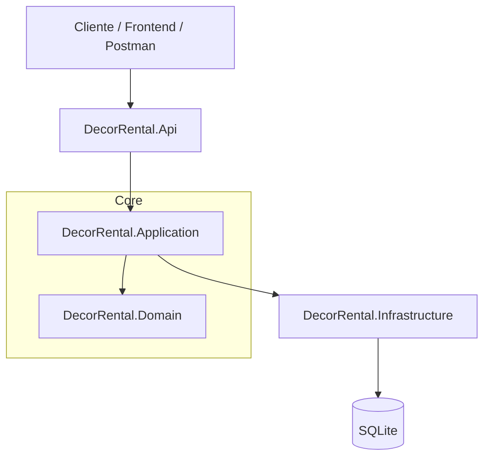

# Diagrama de Arquitetura

```mermaid
flowchart TB
    Client[Cliente / Frontend / Postman]
    API[DecorRental.Api]
    APP[DecorRental.Application]
    DOMAIN[DecorRental.Domain]
    INFRA[DecorRental.Infrastructure]
    DB[(SQLite)]

    Client --> API
    API --> APP
    APP --> DOMAIN
    APP --> INFRA
    INFRA --> DB

    subgraph Core
        DOMAIN
        APP
    end
```
